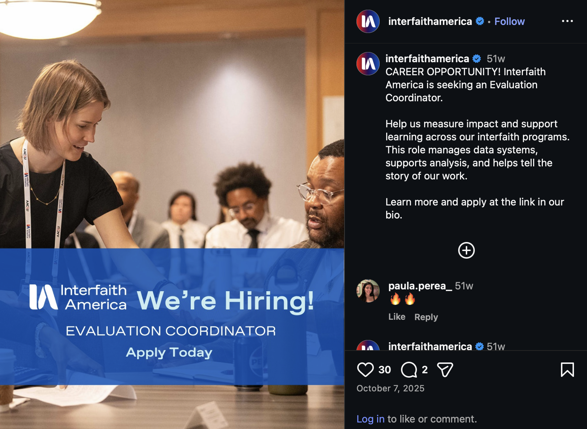
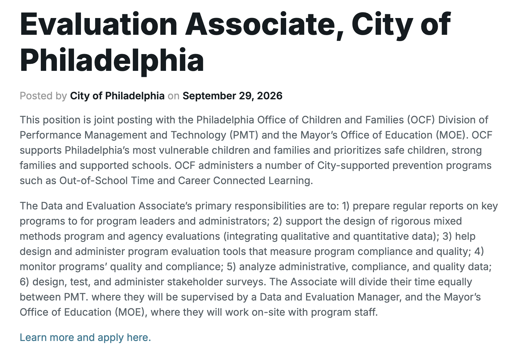
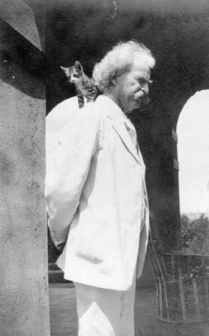

```{=html}
<!--
  HOW THIS FILE WORKS
  - Each "##" heading starts a new slide.
  - A "#" heading starts a section; we style those as divider slides.
  - ::: notes ... ::: holds speaker notes. Press "s" during the talk to open them.
  - ::: {.incremental} reveals list items one at a time.
  - :::: {.columns} with ::: {.column} makes side-by-side layouts.
  - Timings in the notes add up to about 30 minutes.
-->
```

## Before we start {.center}

:::: {.columns .quote-layout}
::: {.column width="40%"}
{.qr fig-alt="QR code linking to the Slido poll"}

[Or visit [this link](https://app.sli.do/event/fo4GTxCcfFRvd2G8yWJiNY){preview-link="false"}]{.qr-caption}
:::
::: {.column width="60%"}
**Take out your phone and answer three quick questions:**

1.  What's your major (or likely major)?
2.  Which IEFI project are you working on?
3.  How comfortable are you working with data? (1–5)
:::
::::

::: notes
\~2 min. Show results live once most people respond. Point out the meta-move: in under a minute we collected data, summarized it, and learned something about this room. That's the whole talk in miniature. Save question 3 — we'll ask it again at the end (pre/post!).
:::

## About me

::::: {.columns .about}
::: {.column width="35%"}
.jpg){.about-photo fig-alt="Photo of Greg Amusu"}
:::

::: {.column width="65%"}
::: incremental
- **Background:** Carleton College, B.A. '19, Princeton University, Ph.D. '26
- **At SSQL:** I help students of all skill levels build quantitative reasoning skills
- **Why this matters to me:** At Princeton, I developed and evaluated DEI programming using quantitative methods
- **Ask me about:** My fieldwork experience in Southeast Asia!
:::
:::
:::::

::: notes
\~1 min. Keep it brief and personal. Mention how own path combined academic interests, community work, and career skills — it sets up the next slide.
:::

## Your fellowship sits where three things meet

::::::::: {.columns .equal-headings}
:::: {.column .fragment width="33%"}
::: panel
[Your academic interests]{.panel-title} The questions, theories, and methods from your coursework.
:::
::::

:::: {.column .fragment width="33%"}
::: {.panel .teal}
[A community need]{.panel-title} A real DEI issue at Swarthmore that your project takes on.
:::
::::

:::: {.column .fragment width="33%"}
::: panel
[Career skills]{.panel-title} Abilities you can name, show, and carry into any field.
:::
::::
:::::::::

<br>

::: fragment
Quantitative skills connect all three.
:::

::: notes
\~1 min. Frame IEFI as an integrative experience. We'll come back to this image at the end.
:::

## The skill employers want most

:::::: {.columns .quote-layout}
::: {.column width="60%"}
{fig-alt="World Economic Forum chart ranking analytical thinking as the most in-demand core skill among employers"}
:::

:::: {.column .fragment width="40%"}
::: side-quote
"According to the World Economic Forum's latest Future of Jobs report, nearly nine in 10 (86%) of employers expect AI and information-processing technologies to transform their business by 2030, while 39% of workers' existing skill sets are expected to change or become outdated. [However, analytical thinking remains the most sought-after core skill, considered essential by seven in 10 employers.]{.highlight}"

[— World Economic Forum, *Future of Jobs Report 2025*]{.quote-source}
:::
::::
::::::

::: notes
\~1 min. Show the chart first and let it land, then click to bring in the quote. Program evaluation is analytical thinking in practice — the skill fellows build by tracking and assessing their projects.
:::

## Evaluation skills fit every project

::: r-stack
::: {.job-card .fragment .fade-out fragment-index=1}
{.screenshot fig-alt="Smithsonian National Museum of African American History and Culture internship listing"}

::: job-text
[1 of 3]{.job-count}

[IEFI project]{.job-label}
[Good Trouble & Good Eats; Bearing Witness, From Page to Place; Faculty & Staff Spotlight Series]{.job-project}

[Opportunity]{.job-label}
[Internships, Smithsonian National Museum of African American History and Culture]{.job-role}

Museums build connection through storytelling, too. Understanding who visits, what resonates, and who feels welcome takes the same skills as measuring belonging around a shared meal.
:::
:::

::: {.job-card .fragment .fade-in-then-out fragment-index=1}
{.screenshot fig-alt="Interfaith America Evaluation Coordinator listing"}

::: job-text
[2 of 3]{.job-count}

[IEFI project]{.job-label}
[Redefining Wellness: The Spiritual Awakening Project]{.job-project}

[Opportunity]{.job-label}
[Evaluation Coordinator, Interfaith America]{.job-role}

The leading national interfaith organization tracks its impact with a logic model and evaluation framework, the same tools that could show whether new gatherings reach students outside traditional religious frameworks.
:::
:::

::: {.job-card .fragment .fade-in fragment-index=2}
{.screenshot fig-alt="City of Philadelphia Evaluation Associate listing"}

::: job-text
[3 of 3]{.job-count}

[IEFI project]{.job-label}
[Revitalizing Learning 4 Life]{.job-project}

[Opportunity]{.job-label}
[Evaluation Associate, City of Philadelphia]{.job-role}

A joint role with the Office of Children and Families and the Mayor's Office of Education, measuring how well learning programs reach and serve residents, just as Learning 4 Life aims to widen participation across roles and generations.
:::
:::
:::

::: notes
~1.5 min. These three projects look qualitative at first glance: storytelling,
spirituality, and lifelong learning. But each connects to a real job where
evaluation skills are central. Whatever your project, the skills transfer.
:::

## Meet the Social Science Quantitative Lab

::::: columns
::: {.column width="55%"}
::: incremental
- One-on-one consultations
- Software: R, Stata, Qualtrics, and more
- Workshops and help with survey design
- Finding and using public data
:::
:::

::: {.column .fragment width="45%"}
**You don't need to be a "stats person."** We meet you where you are.

**Where:** Science Center 205

**When:** Monday–Friday, 9am–5pm

**Book a time:** [swarthmore.edu/ssql](https://www.swarthmore.edu/ssql){preview-link="false"}
:::
:::::

::: notes
\~3 min. Put a face on the lab. Mention who staffs it and how to book.
:::

# Part one:<br>Count what counts {.divider background-color="#8A1F35"}

Tracking and evaluation — for every project

## Why track attendance and engagement?

::: incremental
- **Tell your project's story** to IEFI, your advisors, partners, and future employers.
- **Improve as you go.** Which formats, times, and outreach actually work?
- **Pass it on.** The next fellow inherits evidence, not just memories.
- **Show progress toward IEFI's mission** — not just activity.
:::

::: notes
\~1.5 min.
:::

## Same project, two stories

::::::: columns
:::: {.column width="50%"}
::: panel
[Without data]{.panel-title} "About 40 people came to our events, and people seemed to like them."
:::
::::

:::: {.column .fragment width="50%"}
::: {.panel .teal}
[With data]{.panel-title} [60%]{.big-stat}

[growth in attendance from September to November, and 7 in 10 attendees came back for a second event.]{.stat-label}
:::
::::
:::::::

<br>

::: aside
Illustrative numbers — not from a real project.
:::

::: notes
\~1 min. The second story is more persuasive AND more useful for planning.
:::

## Outputs vs. outcomes

::::: columns
::: {.column .fragment width="50%"}
### Outputs

What you *did* and *who came*

::: incremental
- Number of events
- Attendance and repeat attendance
- Web visits, downloads, sign-ups
:::
:::

::: {.column .fragment width="50%"}
### Outcomes

What *changed* for people

::: incremental
- Knowledge or awareness
- Sense of belonging or connection
- Behavior: did they reach out, return, join?
:::
:::
:::::

::: notes
\~1 min. Outputs are easier to count; outcomes are what matter most. Try to track both.
:::

## A logic model

::::::::::::: {.process .chevron .stepper node-color="#8A1F35"}
:::: item
Resources

::: annotation
**Resources** time, advisors, budget, partners
:::
::::

:::: item
Activities

::: annotation
**Activities** events, a podcast, a survey
:::
::::

:::: item
Outputs

::: annotation
**Outputs** attendance and reach
:::
::::

:::: {.item color="#2E7D6B"}
Outcomes

::: annotation
**Short-term outcomes** awareness, connection
:::
::::

:::: {.item color="#2E7D6B"}
Goals

::: annotation
**Long-term goals** belonging, retention
:::
::::
:::::::::::::

::: notes
\~1.5 min. A logic model is a picture of how your project is supposed to work. Garnet steps are what you do and count; teal steps are what changes for people. Tie back to the outputs vs. outcomes slide.
:::

## IEFI's goals are measurable

Each goal points to something you can track.

::: goal-grid
::: {.panel .fragment}
[Campus climate]{.panel-title}

[As data]{.data-label}
Short surveys on belonging, inclusion, or experiences of bias
:::

::: {.panel .fragment}
[Development and programming]{.panel-title}

[As data]{.data-label}
Attendance, repeat engagement, pre/post change
:::

::: {.panel .fragment}
[Communication and coordination]{.panel-title}

[As data]{.data-label}
Reach and awareness; an inventory of who's doing what
:::

::: {.panel .fragment}
[Recruitment and retention]{.panel-title}

[As data]{.data-label}
Trends in who joins, stays, or leaves a program
:::
:::

::: notes
\~1.5 min. Tracking isn't busywork — it's how you show your project moved the mission forward.
Click through each goal and ask: which of these does your project touch?
:::

## A starter toolkit

::::: columns
::: {.column .fragment width="50%"}
**Collect**

- Sign-in sheet or Google Form / Qualtrics
- A 3-question pre/post survey
- Platform analytics (web, podcast, social)
:::

::: {.column .fragment width="50%"}
**Summarize**

- One tidy spreadsheet, one row per person per event
- Counts, percentages, averages
- One or two clear charts
:::
:::::

::: notes
\~1 min. Start small and be consistent. A simple tracker kept all year beats an elaborate one abandoned in October.
:::

## Handle DEI data with care

::: incremental
- **Small numbers identify people.** Report in aggregate; combine small groups.
- **Make identity questions optional** and word them carefully.
- **Get consent** and explain how data will be used and stored.
- **Watch for survey fatigue** — fewer, better questions.
- **Ask who isn't in the room.** Attendance only counts people who came.
- **Presenting or publishing?** Check whether IRB review applies.
:::

::: notes
\~1.5 min. Examples: disability status is often undisclosed; religious identity is sensitive; athletes on small teams are easy to identify.
:::

## What gets lost when we count?

:::::: {.columns .quote-layout}
::: {.column width="35%"}
{fig-alt="Cover of The Seductions of Quantification by Sally Engle Merry"}
:::

:::: {.column .fragment width="65%"}
::: {.side-quote .roomy}
"We live in a world where seemingly everything can be measured. We rely on indicators to translate social phenomena into simple, quantified terms, which in turn can be used to guide individuals, organizations, and governments in establishing policy. Yet counting things requires finding a way to make them comparable. And in the process of translating the confusion of social life into neat categories, we inevitably strip it of context and meaning—and risk hiding or distorting as much as we reveal."

[— University of Chicago Press, on Sally Engle Merry's *The Seductions of Quantification* (2016)]{.quote-source}
:::
::::
::::::

::: notes
\~1 min. Merry was an anthropologist who studied global indicators on human rights, gender violence, and sex trafficking. Her point for fellows: numbers are powerful because they simplify, and that same simplification can hide the people and context behind them. Measure, but stay alert to what your categories leave out. Pair numbers with stories.
:::

## A more lighthearted example

:::::: {.columns .quote-layout}
::: {.column width="35%"}
{fig-alt="Portrait of Mark Twain"}
:::

:::: {.column width="65%"}
::: big-quote
"There are three kinds of lies: lies, damned lies, and statistics."

[— Mark Twain (popularized)]{.quote-source}
:::
::::
::::::


::: notes
\~1 min. A laugh line with a real point: numbers can mislead when they're chosen or presented carelessly — which is why the care we just discussed matters. And the quote itself is a lesson in checking sources: even a famous line about misleading information is usually misattributed.
:::

## Your turn: two minutes {background-color="#EEF1F4"}

On a scrap of paper or your phone:

1.  Write your project's logic model in one line.
2.  Circle **one number** you could start tracking this week.

[2:00]{.big-stat}

::: notes
\~2 min. Invite one or two people to share. Stretch goal for the deck: try the "countdown" Quarto extension for a live timer.
:::

# Part two<br>Bring a method into your project {.divider background-color="#8A1F35"}

Quantitative social science as part of the work itself

## Methods fit every stage of the arc

::::::::::: {.process .chevron .stepper node-color="#8A1F35"}
:::: item
Identify

::: annotation
**Identify** show the issue exists with a needs survey or existing data
:::
::::

:::: item
Explore

::: annotation
**Explore** learn what's known from research and peer benchmarks
:::
::::

:::: item
Implement

::: annotation
**Implement** see what's working through tracking and feedback
:::
::::

:::: item
Present

::: annotation
**Present** make recommendations backed by charts and data stories
:::
::::
:::::::::::

::: notes
\~1.5 min. Every fellow identifies an issue, explores it, implements, and presents recommendations. A method can strengthen any of those four steps.
:::

## Two places a method can live

::::::: columns
:::: {.column .fragment width="50%"}
::: panel
[In your programming]{.panel-title}

- A needs-assessment survey before you plan
- Public data to describe the issue
- Mapping where people or resources are
- Comparing two outreach approaches
:::
::::

:::: {.column .fragment width="50%"}
::: {.panel .teal}
[In your reflection]{.panel-title}

- Analyze your own tracking data
- Pre/post self-assessment of your skills
- Connect to research and methods from your courses
:::
::::
:::::::

::: notes
\~1.5 min.
:::

## Choose your level

::::::::: columns
:::: {.column .fragment width="33%"}
::: panel
[Light]{.panel-title} Attendance tracking and a short feedback form
:::
::::

:::: {.column .fragment width="33%"}
::: panel
[Medium]{.panel-title} A pre/post survey, or a data-based profile of the issue
:::
::::

:::: {.column .fragment width="33%"}
::: panel
[Deep]{.panel-title} A small research design, a mapping project, or a poster or thesis seed
:::
::::
:::::::::

::: notes
\~1 min. Everyone should do "light." Many projects can reach "medium."
:::

## One campus, many surveys

Several projects may survey the same students about belonging, awareness, or climate.

::: incremental
- Coordinate timing through SSQL to avoid survey fatigue.
- Consider a few **shared questions** so results can be compared across projects.
- Shared data makes the IEFI 2.0 evaluation stronger too.
:::

::: notes
\~1 min.
:::

## Numbers, with a critical eye

- Categories like race, gender, and disability are *choices* — who made them, and who fits?
- What gets counted shapes what gets funded and fixed.
- Critical quantitative approaches (QuantCrit) ask how data can reinforce *or* challenge inequity.

Quantitative methods and equity work aren't at odds — done thoughtfully, they strengthen each other.

::: notes
\~1.5 min. Great integrative hook for students in sociology, political science, economics, education, and ethnic studies.
:::

# Bringing it together {.divider background-color="#8A1F35"}

## Skills you can name

:::::: columns
::: {.column width="45%"}
- Data literacy
- Survey design
- Program evaluation
- Data storytelling
- Presenting recommendations
:::

:::: {.column width="55%"}
**On your résumé:**

> Designed and administered a pre/post survey to evaluate a campus belonging program reaching 120 students; presented findings and recommendations to college leadership.

::: aside
Illustrative example.
:::
::::
::::::

::: notes
\~2 min. Presenting to the community = briefing a board, writing a policy memo, reporting to a funder. Return to the three-circles image.
:::

## Your next steps

1.  **Pick one number** to track, starting now.
2.  **Choose a level** — light, medium, or deep — for a method in your project.
3.  **Book an SSQL consultation** by the end of fall break.


::: notes
\~1 min. Re-ask poll question 3 and show the before/after — a live pre/post design.
:::

## Questions? {.center}

gamusu1@swarthmore.edu

Slides will be shared you!